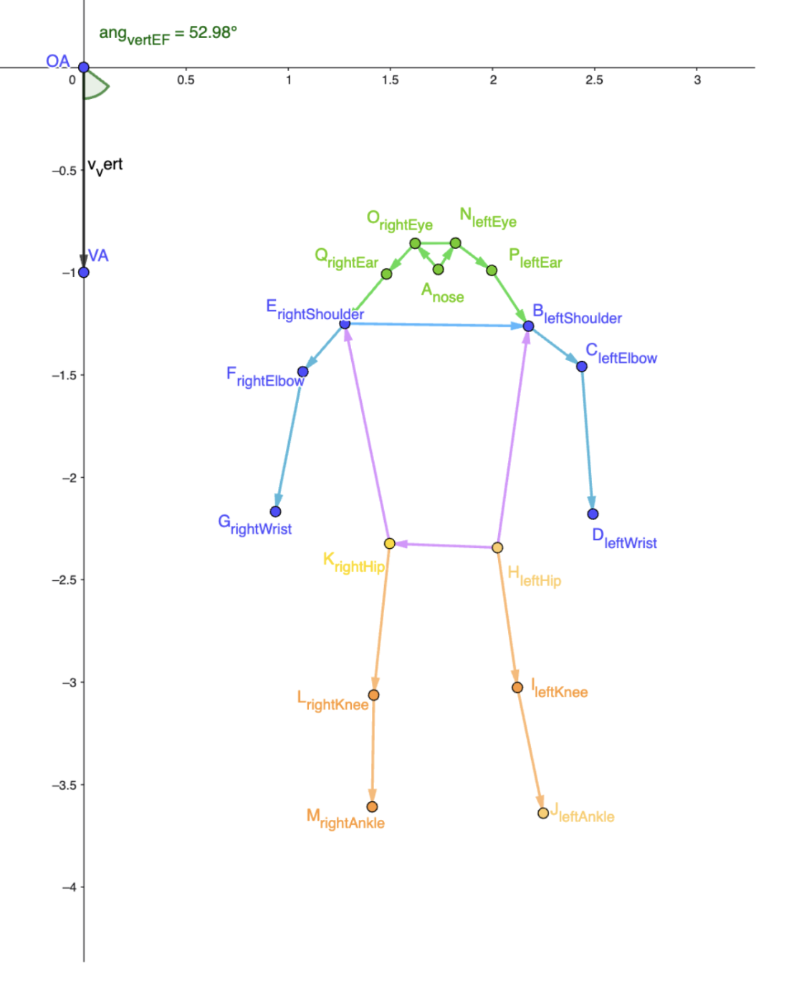

# Keypoint Detection

Tecolotl Retail will use human pose keypoints as the first step toward estimating body orientation and possible shelf attention.

The current objective is not to detect gaze precisely. The objective is to extract body landmarks that can later help estimate whether a person is likely oriented toward a retail shelf.

## Current Model

The first implementation uses the Raspberry Pi AI Camera with the Sony IMX500 and the official HigherHRNet pose estimation model.

The model outputs 17 human keypoints per detected person.

## COCO Keypoints

The model follows the standard [COCO human pose keypoint format](https://docs.ultralytics.com/datasets/pose/coco/).

<div style="display: flex; gap: 2rem; align-items: flex-start;">

<div>

| Index | Keypoint |
| :--- | :--- |
| 0 | Nose |
| 1 | Left eye |
| 2 | Right eye |
| 3 | Left ear |
| 4 | Right ear |
| 5 | Left shoulder |
| 6 | Right shoulder |
| 7 | Left elbow |
| 8 | Right elbow |
| 9 | Left wrist |
| 10 | Right wrist |
| 11 | Left hip |
| 12 | Right hip |
| 13 | Left knee |
| 14 | Right knee |
| 15 | Left ankle |
| 16 | Right ankle |

</div>

<div>



</div>

</div>

Each detected person is represented as a list of 17 keypoints. Each keypoint is a structure with three fields:

```txt
x          – horizontal image coordinate
y          – vertical image coordinate
confidence – model confidence score for that keypoint (0.0 to 1.0)
```

The exact representation depends on the library used. In Python with the IMX500 SDK, each keypoint is typically accessed as an object with named attributes (`kp.x`, `kp.y`, `kp.conf`) or as a tuple `(x, y, confidence)`. The three values are always in that order.

## Relevant Keypoints for Retail Attention

For shelf attention, the most relevant keypoints are:

| Keypoints | Use |
| :--- | :--- |
| Left shoulder / right shoulder | Estimate upper-body orientation |
| Left hip / right hip | Stabilize torso orientation |
| Nose | Approximate head direction |
| Eyes / ears | Support head orientation when visible |

The first version should focus mainly on shoulders and hips.

## Simple Orientation Idea

A person standing in front of a shelf will usually show a different shoulder/hip alignment than a person walking past the shelf.

The first heuristic is:
> Use the line between left shoulder and right shoulder to estimate the apparent orientation of the torso.

A second heuristic is:
> Use the line between left hip and right hip to confirm or stabilize the torso estimate.

If shoulders and hips suggest a similar direction, the orientation estimate is more reliable.

## Head Direction Signal

Head keypoints can provide an additional signal. Useful head keypoints:
* `nose`
* `left_eye`
* `right_eye`
* `left_ear`
* `right_ear`

However, head direction should not be treated as a perfect gaze estimator. A person may look at a shelf without the camera clearly seeing the eyes. The system should only treat head keypoints as a weak support signal.

## Initial Assumption

The first shelf-attention assumption is:

> If a person is near a shelf zone, and their shoulders/hips/head are oriented toward that zone, then the person may be paying attention to the shelf.

This is not eye tracking. This is only a pose-based approximation.

## Implementation Path

The first programming step is not shelf attention yet. The first step is to extract and print the keypoints from the IMX500 model.

Recommended first steps:

1. Run the official [IMX500 HigherHRNet pose demo](https://github.com/raspberrypi/picamera2/blob/main/examples/imx500/imx500_pose_estimation_higherhrnet_demo.py).
2. Confirm that the model detects the 17 keypoints.
3. Print the keypoints for each detected person.
4. Filter only the relevant keypoints:
   * Shoulders
   * Hips
   * Nose
   * Eyes
   * Ears
5. Draw only those keypoints on screen.
6. Save sample frames and logs.
7. Evaluate if shoulders and hips are stable enough for orientation estimation.

## References

- Ultralytics Pose Estimation Documentation  
  https://docs.ultralytics.com/tasks/pose/